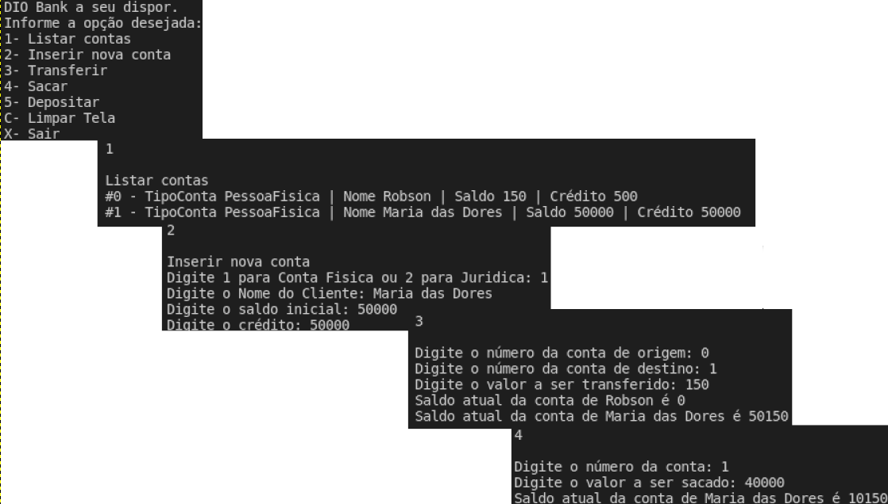

## Creating an bank transfer application with .NET
This application was presented and developed by <a href="https://www.linkedin.com/in/eliezerzarpelao/">Eliézer Zarpelão</a> and  <a href="https://web.digitalinnovation.one/home">Digital Innovation One</a>. It was part of the .NET Fundamentals bootcamp.

The main goal was to learn the basics regarding to POO, how to model its domain as well as the usage of enums. It has basics bank account's functions such as create a new account, see account list, transfer, withdraw, deposit as you can see in the image below:

